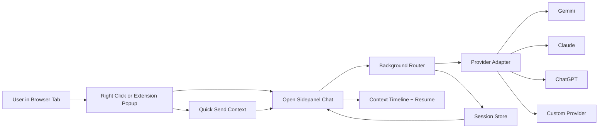

# AI Assistant Browser Extension

A cross-browser AI extension for Chrome, Firefox, and Brave that lets you chat with AI inside a sidepanel using live browser context.


## What It Does
- Opens a beautiful sidepanel chat in-browser.
- Uses modern messenger-style chat bubbles (assistant left, user right).
- Captures and sends context:
  - Current page URL
  - Selected text
  - Selected element snapshot (selector, text, metadata)
  - Screenshot (one-click capture of current tab)
  - Drag-and-drop or paste image into chat
- Includes default slash skills:
  - /screenshot
  - /select-element
  - /test-section
  - /test-feature
- Chat composer behavior:
  - Enter sends message
  - Shift+Enter creates a new line
- Supports multiple AI providers:
  - Gemini
  - Claude
  - ChatGPT
  - Future custom providers via plugin-style adapter contract
- Keeps persistent sessions:
  - Resume old chat
  - Create new chat
  - View per-session context history timeline
- Right-click quick actions:
  - Open AI chat
  - Send selected text immediately
  - Send page URL immediately
  - Send selected element snapshot

## Wireframes and Design Direction
- Browser-first layout: current tab stays on the left, AI chat sidepanel on the right.
- Sidepanel uses simple background colors and WhatsApp/Messenger-style bubble flow.
- Context chips and capture controls are kept near the composer for fast testing loops.

Wireframes are maintained in docs for cleaner README landing:
- [Sidepanel Wireframe](docs/assets/wireframe-sidepanel.svg)
- [Context Capture Wireframe](docs/assets/wireframe-context-capture.svg)
- [UAT QA Wireframe](docs/assets/wireframe-uat-qa.svg)

## Workflow Overview


## Architecture at a Glance
- Sidepanel-first UX for full chat flow
- Background router for provider-agnostic message handling
- Provider adapters for each AI backend
- Session + context event persistence for resumable history

Read detailed architecture:
- [docs/ARCHITECTURE.md](docs/ARCHITECTURE.md)

## Development Plan
- Master implementation checklist:
  - [docs/IMPLEMENTATION_CHECKLIST.md](docs/IMPLEMENTATION_CHECKLIST.md)
- Live status tracker:
  - [docs/PROGRESS.md](docs/PROGRESS.md)
- Git and PR policy:
  - [docs/GIT_WORKFLOW.md](docs/GIT_WORKFLOW.md)
- Store compliance requirements:
  - [docs/STORE_COMPLIANCE.md](docs/STORE_COMPLIANCE.md)
- Release gate checklist:
  - [docs/RELEASE_CHECKLIST.md](docs/RELEASE_CHECKLIST.md)

## Branch and PR Strategy
- Each feature must be on an individual branch.
- Open PR to main.
- PR validation workflow must pass before merge.
- Merge only after functional validation is complete.
- Merges to main trigger publish workflow.

## GitHub Actions
### 1) PR Validation
Workflow: [.github/workflows/pr-validation.yml](.github/workflows/pr-validation.yml)
- Guardrails for branch and PR title tags
- Lint/test/build checks (when scripts exist)

### 2) Chrome Publish
Workflow: [.github/workflows/publish-chrome.yml](.github/workflows/publish-chrome.yml)
- Runs on push to main (and manual dispatch)
- Builds extension artifact
- Publishes to Chrome Web Store

## Required GitHub Secrets for Chrome Publish
Set these in repository settings:
- CHROME_EXTENSION_CLIENT_ID
- CHROME_EXTENSION_CLIENT_SECRET
- CHROME_EXTENSION_REFRESH_TOKEN
- CHROME_EXTENSION_ID

## Local Setup (once scaffolded)
```bash
npm install
npm run dev
npm run lint
npm test
npm run build
```

## Publish Readiness
Before release, confirm:
- Checklist chunks complete for targeted phase
- [docs/STORE_COMPLIANCE.md](docs/STORE_COMPLIANCE.md) complete
- [docs/RELEASE_CHECKLIST.md](docs/RELEASE_CHECKLIST.md) complete

## License
Add your preferred license file before public release.
