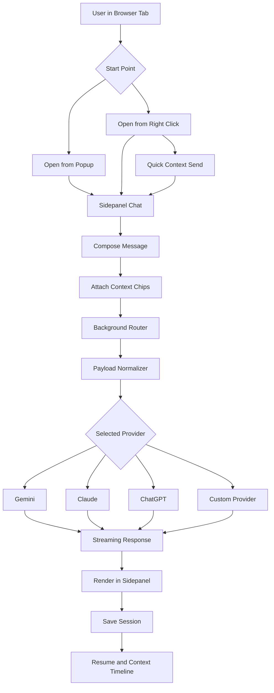

# AI Assistant Browser Extension

A cross-browser AI extension for Chrome, Firefox, and Brave that lets you chat with AI in a browser sidepanel using live page context.


## What It Does
- Open sidepanel chat without leaving the page.
- Send context directly from browser interactions:
  - page URL
  - selected text
  - selected element snapshot
  - screenshot, pasted image, or dropped image
- Use slash skills for quick actions:
  - /screenshot
  - /select-element
  - /test-section
  - /test-feature
- Switch providers: Gemini, Claude, ChatGPT (plus future custom adapters).
- Keep sessions persistent: new chat, resume chat, and per-session context timeline.

## Workflow Overview


## Use It
```bash
npm install
npm run dev
npm run lint
npm test
npm run build
```

## Docs
- Architecture: [docs/ARCHITECTURE.md](docs/ARCHITECTURE.md)
- Implementation checklist: [docs/IMPLEMENTATION_CHECKLIST.md](docs/IMPLEMENTATION_CHECKLIST.md)
- Phase execution plan: [docs/PHASE_EXECUTION_PLAN.md](docs/PHASE_EXECUTION_PLAN.md)
- Progress tracker: [docs/PROGRESS.md](docs/PROGRESS.md)
- Wireframes and UI contracts: [docs/WIREFRAMES.md](docs/WIREFRAMES.md)
- Git and PR workflow: [docs/GIT_WORKFLOW.md](docs/GIT_WORKFLOW.md)
- Store compliance: [docs/STORE_COMPLIANCE.md](docs/STORE_COMPLIANCE.md)
- Release checklist: [docs/RELEASE_CHECKLIST.md](docs/RELEASE_CHECKLIST.md)

## License
Add your preferred license file before public release.
