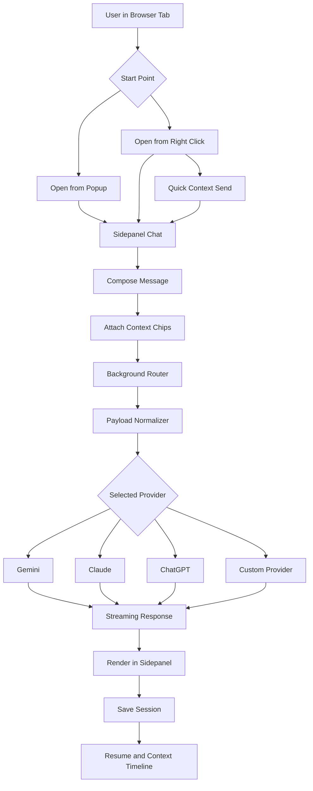

# njw-xarvis: AI Assistant Browser Extension

A cross-browser AI extension for Chrome, Firefox, and Brave that lets you chat with AI in a browser sidepanel using live page context.

**🚀 Live Demo & Backend:** Hosted on Vercel → [njw-xarvis.vercel.app](https://njw-xarvis.vercel.app)


## What It Does
- Open sidepanel chat without leaving the page.
- Send context directly from browser interactions:
  - page URL
  - selected text
  - selected element snapshot
  - screenshot, pasted image, or dropped image
- Use slash skills for quick actions:
  - /screenshot
  - /select-element
  - /test-section
  - /test-feature
- Switch providers: Gemini, Claude, ChatGPT (plus future custom adapters).
- Keep sessions persistent: new chat, resume chat, and per-session context timeline.

## Workflow Overview


## Quick Start
```bash
git clone https://github.com/Not-Just-Web/ai-assistant-extension.git
cd ai-assistant-extension
yarn install
yarn dev
yarn lint
yarn test
yarn build
```

## Architecture & Deployment

### Single Vercel Domain

All services deployed on one Vercel domain: **njw-xarvis.vercel.app**

```
https://njw-xarvis.vercel.app/
├── /                    → Landing page with extension preview
└── /api/*               → Connector API endpoints
```

**Extension:** Builds locally and loads into browser (Chrome/Firefox/Brave)  
**Connector API:** Deployed on Vercel at `/api` path  
**Communication:** Extension uses relative `/api` path (auto-connects at build time)

## Dual Development: Extension + Connector API

This project includes an optional backend connector API for secure credential handling and provider proxying.

### Setup Both Extension and API

```bash
# Install all dependencies (extension + connector-api)
npm run setup

# Run extension and API together in one command
npm run dev:all

# OR run separately:
# Terminal 1: Extension (Chromium target)
npm run dev

# Terminal 2: Connector API
npm run dev:api
```

### Build Everything

```bash
# Full build and validation (both extension and connector API)
npm run validate:all

# Or individually:
npm run build:all          # Build both
npm run typecheck:all      # Type check both
npm run lint:all           # Lint both
npm run test:all           # Test both
```

## Production Deployment

### Single Vercel Domain with Multiple Routes

Deploy everything to one Vercel project: **njw-xarvis**

- `https://njw-xarvis.vercel.app/` → Landing page with extension preview
- `https://njw-xarvis.vercel.app/api/*` → Connector API endpoints

#### 1. Deploy Connector API to Vercel

**Vercel Deployment Steps:**
1. Push this repository to GitHub
2. Go to [https://vercel.com](https://vercel.com) and sign in with GitHub
3. Click "New Project"
4. Select this GitHub repository
5. Vercel will automatically detect `vercel.json` with pre-configured environment variables
6. Add the required secret:
   - Click "Environment Variables"
   - Add `JWT_SECRET`: Generate a strong secret with `openssl rand -base64 32`
   - Other variables (`NODE_ENV`, `PORT`, `ALLOWED_ORIGINS`) are pre-configured
7. Click "Deploy"

The connector API will be automatically built and deployed at `https://njw-xarvis.vercel.app/api/`.

#### 2. Build Extension Locally

```bash
# No environment variable needed!
# Extension automatically uses /api relative path on Vercel
# Build extension (local only - no deployment needed)
npm run build:chromium
npm run build:firefox
```

#### 3. Load Extension into Browser

**Chrome or Brave:**
1. Open `chrome://extensions` (or `brave://extensions`)
2. Enable Developer mode
3. Click "Load unpacked"
4. Select `dist/chromium`

**Firefox:**
1. Open `about:debugging#/runtime/this-firefox`
2. Click "Load Temporary Add-on"
3. Select `dist/firefox/manifest.json`

#### 4. Extension Auto-Connects

The extension automatically connects to `/api` endpoints on Vercel.

### Verify Deployment

```bash
# Test your Vercel API
curl https://njw-xarvis.vercel.app/api/health

# Expected response:
# {
#   "status": "ok",
#   "version": "1.0.0",
#   "timestamp": "2026-05-07T12:00:00Z"
# }
```

## Bun Alternative
```bash
bun install
bun run dev
bun run lint
bun run test
bun run build
```

## Build Outputs
- Chromium build folder: `dist/chromium`
- Firefox build folder: `dist/firefox`

## Import Extension in Browser
### Chrome or Brave
1. Open `chrome://extensions` (or `brave://extensions`).
2. Enable Developer mode.
3. Click Load unpacked.
4. Select `dist/chromium`.

### Firefox
1. Open `about:debugging#/runtime/this-firefox`.
2. Click Load Temporary Add-on.
3. Select `dist/firefox/manifest.json`.

## Build Process
1. `yarn build:chromium` generates MV3 package in `dist/chromium`.
2. `yarn build:firefox` generates Firefox package in `dist/firefox`.
3. `yarn build` runs both targets.

Using bun for the same commands:
1. `bun run build:chromium`
2. `bun run build:firefox`
3. `bun run build`

## Docs
- Architecture: [docs/ARCHITECTURE.md](docs/ARCHITECTURE.md)
- Implementation checklist: [docs/IMPLEMENTATION_CHECKLIST.md](docs/IMPLEMENTATION_CHECKLIST.md)
- Phase execution plan: [docs/PHASE_EXECUTION_PLAN.md](docs/PHASE_EXECUTION_PLAN.md)
- Progress tracker: [docs/PROGRESS.md](docs/PROGRESS.md)
- Wireframes and UI contracts: [docs/WIREFRAMES.md](docs/WIREFRAMES.md)
- Git and PR workflow: [docs/GIT_WORKFLOW.md](docs/GIT_WORKFLOW.md)
- Store compliance: [docs/STORE_COMPLIANCE.md](docs/STORE_COMPLIANCE.md)
- Release checklist: [docs/RELEASE_CHECKLIST.md](docs/RELEASE_CHECKLIST.md)

## License
Add your preferred license file before public release.
