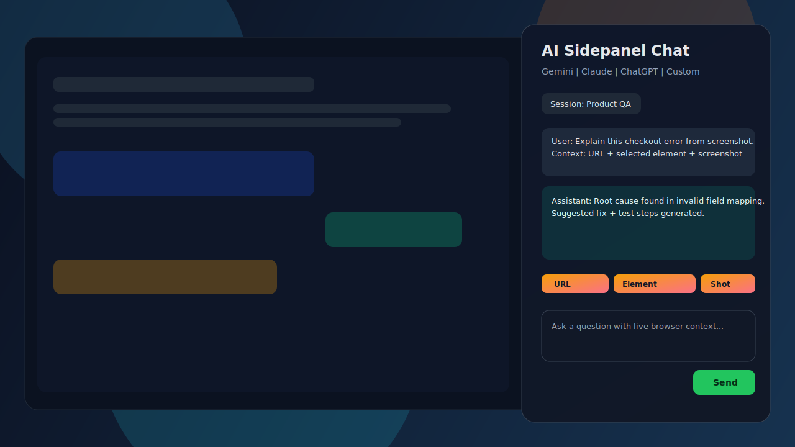

# AI Assistant Browser Extension

A cross-browser AI extension for Chrome, Firefox, and Brave that lets you chat with AI inside a sidepanel using live browser context.



## What It Does
- Opens a beautiful sidepanel chat in-browser.
- Uses modern messenger-style chat bubbles (assistant left, user right).
- Captures and sends context:
  - Current page URL
  - Selected text
  - Selected element snapshot (selector, text, metadata)
  - Screenshot (one-click capture of current tab)
  - Drag-and-drop or paste image into chat
- Includes default slash skills:
  - /screenshot
  - /select-element
  - /test-section
  - /test-feature
- Chat composer behavior:
  - Enter sends message
  - Shift+Enter creates a new line
- Supports multiple AI providers:
  - Gemini
  - Claude
  - ChatGPT
  - Future custom providers via plugin-style adapter contract
- Keeps persistent sessions:
  - Resume old chat
  - Create new chat
  - View per-session context history timeline
- Right-click quick actions:
  - Open AI chat
  - Send selected text immediately
  - Send page URL immediately
  - Send selected element snapshot

## Wireframes and Design Direction
- Browser-first layout: current tab stays on the left, AI chat sidepanel on the right.
- Sidepanel uses simple background colors and WhatsApp/Messenger-style bubble flow.
- Context chips and capture controls are kept near the composer for fast testing loops.

Wireframes are maintained in docs for cleaner README landing:
- [Wireframe Guide](docs/WIREFRAMES.md)
- [Hero Preview](docs/assets/sidepanel-hero.svg)
- [Sidepanel Wireframe](docs/assets/wireframe-sidepanel.svg)
- [Context Capture Wireframe](docs/assets/wireframe-context-capture.svg)
- [UAT QA Wireframe](docs/assets/wireframe-uat-qa.svg)

## Workflow Overview

### What Users Can Do
- Open AI chat from popup or right-click menu without leaving the current page.
- Send context instantly from the browser:
  - Selected text
  - Selected element snapshot
  - Current page URL
  - Screenshot or pasted/dropped image
- Use slash skills to speed up common tasks:
  - /screenshot
  - /select-element
  - /test-section
  - /test-feature
- Switch providers per workflow (Gemini, Claude, ChatGPT, and future custom providers).
- Keep work organized with sessions:
  - Start new chat
  - Resume previous chat
  - Review per-session context timeline

### How It Works
1. User starts from popup or browser context menu.
2. Extension opens sidepanel and preloads context when launched from quick actions.
3. User can add/remove context chips before sending.
4. Background service normalizes the request payload.
5. Active provider adapter sends request to selected AI backend.
6. Response streams back into sidepanel chat UI.
7. Chat and context events are persisted in session history for resume/replay.

```mermaid
flowchart TD
    A[User Browsing Any Tab] --> B{Entry Point}
    B --> B1[Extension Popup]
    B --> B2[Right Click Context Menu]

    B1 --> C[Open Sidepanel Chat]
    B2 --> C
    B2 --> D[Quick Send Selected Text or URL or Element]
    D --> C

    C --> E[Composer + Context Chips]
    E --> E1[Enter Send]
    E --> E2[Shift+Enter Newline]
    E --> E3[Slash Skills]
    E3 --> E31[/screenshot]
    E3 --> E32[/select-element]
    E3 --> E33[/test-section]
    E3 --> E34[/test-feature]

    E --> F[Background Request Router]
    F --> G[Payload Normalizer]
    G --> H{Selected Provider}

    H --> H1[Gemini Adapter]
    H --> H2[Claude Adapter]
    H --> H3[ChatGPT Adapter]
    H --> H4[Custom Adapter]

    H1 --> I[AI Response Stream]
    H2 --> I
    H3 --> I
    H4 --> I

    I --> J[Sidepanel Message Render]
    J --> K[Session Storage]
    K --> L[Session List and Resume]
    K --> M[Per-Session Context Timeline]
```

## Architecture at a Glance
- Sidepanel-first UX for full chat flow
- Background router for provider-agnostic message handling
- Provider adapters for each AI backend
- Session + context event persistence for resumable history

Read detailed architecture:
- [docs/ARCHITECTURE.md](docs/ARCHITECTURE.md)

## Development Plan
- Master implementation checklist:
  - [docs/IMPLEMENTATION_CHECKLIST.md](docs/IMPLEMENTATION_CHECKLIST.md)
- Phase execution map:
  - [docs/PHASE_EXECUTION_PLAN.md](docs/PHASE_EXECUTION_PLAN.md)
- Live status tracker:
  - [docs/PROGRESS.md](docs/PROGRESS.md)
- Git and PR policy:
  - [docs/GIT_WORKFLOW.md](docs/GIT_WORKFLOW.md)
- Store compliance requirements:
  - [docs/STORE_COMPLIANCE.md](docs/STORE_COMPLIANCE.md)
- Release gate checklist:
  - [docs/RELEASE_CHECKLIST.md](docs/RELEASE_CHECKLIST.md)

## Branch and PR Strategy
- Each feature must be on an individual branch.
- Open PR to main.
- PR validation workflow must pass before merge.
- Merge only after functional validation is complete.
- Merges to main trigger publish workflow.

## GitHub Actions
### 1) PR Validation
Workflow: [.github/workflows/pr-validation.yml](.github/workflows/pr-validation.yml)
- Guardrails for branch and PR title tags
- Lint/test/build checks (when scripts exist)

### 2) Chrome Publish
Workflow: [.github/workflows/publish-chrome.yml](.github/workflows/publish-chrome.yml)
- Runs on push to main (and manual dispatch)
- Builds extension artifact
- Publishes to Chrome Web Store

## Required GitHub Secrets for Chrome Publish
Set these in repository settings:
- CHROME_EXTENSION_CLIENT_ID
- CHROME_EXTENSION_CLIENT_SECRET
- CHROME_EXTENSION_REFRESH_TOKEN
- CHROME_EXTENSION_ID

## Local Setup (once scaffolded)
```bash
npm install
npm run dev
npm run lint
npm test
npm run build
```

## Publish Readiness
Before release, confirm:
- Checklist chunks complete for targeted phase
- [docs/STORE_COMPLIANCE.md](docs/STORE_COMPLIANCE.md) complete
- [docs/RELEASE_CHECKLIST.md](docs/RELEASE_CHECKLIST.md) complete

## License
Add your preferred license file before public release.
