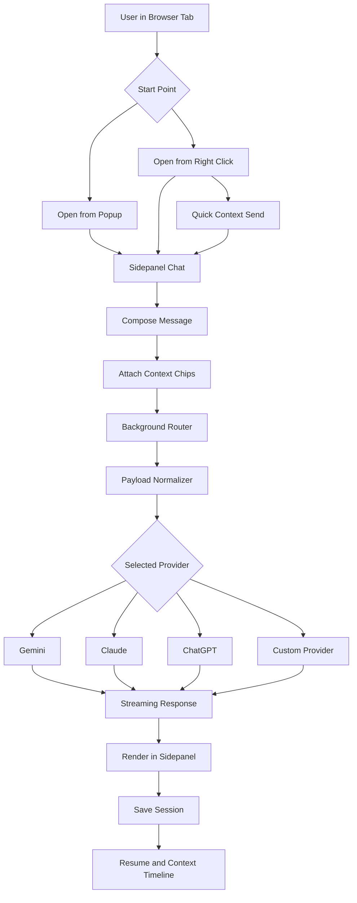

# AI Assistant Browser Extension

A cross-browser AI extension for Chrome, Firefox, and Brave that lets you chat with AI in a browser sidepanel using live page context.


## What It Does
- Open sidepanel chat without leaving the page.
- Send context directly from browser interactions:
  - page URL
  - selected text
  - selected element snapshot
  - screenshot, pasted image, or dropped image
- Use slash skills for quick actions:
  - /screenshot
  - /select-element
  - /test-section
  - /test-feature
- Switch providers: Gemini, Claude, ChatGPT (plus future custom adapters).
- Keep sessions persistent: new chat, resume chat, and per-session context timeline.

## Workflow Overview


## Quick Start
```bash
git clone https://github.com/Not-Just-Web/ai-assistant-extension.git
cd ai-assistant-extension
yarn install
yarn dev
yarn lint
yarn test
yarn build
```

## Dual Development: Extension + Connector API

This project includes an optional backend connector API for secure credential handling and provider proxying.

### Setup Both Extension and API

```bash
# Install all dependencies (extension + connector-api)
npm run setup

# Run extension and API together in one command
npm run dev:all

# OR run separately:
# Terminal 1: Extension (Chromium target)
npm run dev

# Terminal 2: Connector API
npm run dev:api
```

### Build Everything

```bash
# Full build and validation (both extension and connector API)
npm run validate:all

# Or individually:
npm run build:all          # Build both
npm run typecheck:all      # Type check both
npm run lint:all           # Lint both
npm run test:all           # Test both
```

## Production Deployment

### Connector API Only (Recommended)

Only the **Connector API** needs to be deployed to Vercel. The **extension builds locally** and loads into your browser.

#### 1. Deploy Connector API to Vercel

```bash
# Create .env file with your Vercel URL (after deployment)
echo "VITE_CONNECTOR_API_URL=https://your-project-name.vercel.app" > .env
```

**Vercel Deployment Steps:**
1. Push this repository to GitHub
2. Go to [https://vercel.com](https://vercel.com) and sign in with GitHub
3. Click "New Project"
4. Select this GitHub repository
5. Configure environment variables:
   - `JWT_SECRET`: Generate a strong secret: `openssl rand -base64 32`
   - `ALLOWED_ORIGINS`: `chrome-extension://*,moz-extension://*`
6. Click "Deploy" — Vercel will automatically build and deploy the connector API

#### 2. Build Extension Locally

```bash
# Update environment with your Vercel URL
echo "VITE_CONNECTOR_API_URL=https://your-project-name.vercel.app" > .env

# Build extension (local only - no deployment needed)
npm run build:chromium
npm run build:firefox
```

#### 3. Load Extension into Browser

**Chrome or Brave:**
1. Open `chrome://extensions` (or `brave://extensions`)
2. Enable Developer mode
3. Click "Load unpacked"
4. Select `dist/chromium`

**Firefox:**
1. Open `about:debugging#/runtime/this-firefox`
2. Click "Load Temporary Add-on"
3. Select `dist/firefox/manifest.json`

#### 4. Extension Auto-Connects

The extension automatically connects to your Vercel-hosted connector API configured at build time.

### Verify Deployment

```bash
# Test your Vercel API
curl https://your-project-name.vercel.app/health

# Expected response:
# {
#   "status": "ok",
#   "version": "1.0.0",
#   "timestamp": "2026-05-07T12:00:00Z"
# }
```

## Bun Alternative
```bash
bun install
bun run dev
bun run lint
bun run test
bun run build
```

## Build Outputs
- Chromium build folder: `dist/chromium`
- Firefox build folder: `dist/firefox`

## Import Extension in Browser
### Chrome or Brave
1. Open `chrome://extensions` (or `brave://extensions`).
2. Enable Developer mode.
3. Click Load unpacked.
4. Select `dist/chromium`.

### Firefox
1. Open `about:debugging#/runtime/this-firefox`.
2. Click Load Temporary Add-on.
3. Select `dist/firefox/manifest.json`.

## Build Process
1. `yarn build:chromium` generates MV3 package in `dist/chromium`.
2. `yarn build:firefox` generates Firefox package in `dist/firefox`.
3. `yarn build` runs both targets.

Using bun for the same commands:
1. `bun run build:chromium`
2. `bun run build:firefox`
3. `bun run build`

## Docs
- Architecture: [docs/ARCHITECTURE.md](docs/ARCHITECTURE.md)
- Implementation checklist: [docs/IMPLEMENTATION_CHECKLIST.md](docs/IMPLEMENTATION_CHECKLIST.md)
- Phase execution plan: [docs/PHASE_EXECUTION_PLAN.md](docs/PHASE_EXECUTION_PLAN.md)
- Progress tracker: [docs/PROGRESS.md](docs/PROGRESS.md)
- Wireframes and UI contracts: [docs/WIREFRAMES.md](docs/WIREFRAMES.md)
- Git and PR workflow: [docs/GIT_WORKFLOW.md](docs/GIT_WORKFLOW.md)
- Store compliance: [docs/STORE_COMPLIANCE.md](docs/STORE_COMPLIANCE.md)
- Release checklist: [docs/RELEASE_CHECKLIST.md](docs/RELEASE_CHECKLIST.md)

## License
Add your preferred license file before public release.
